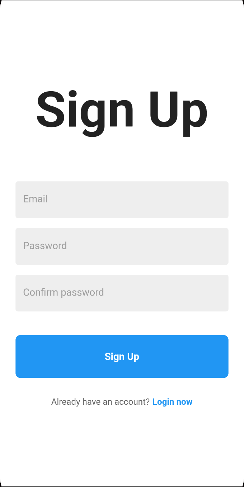
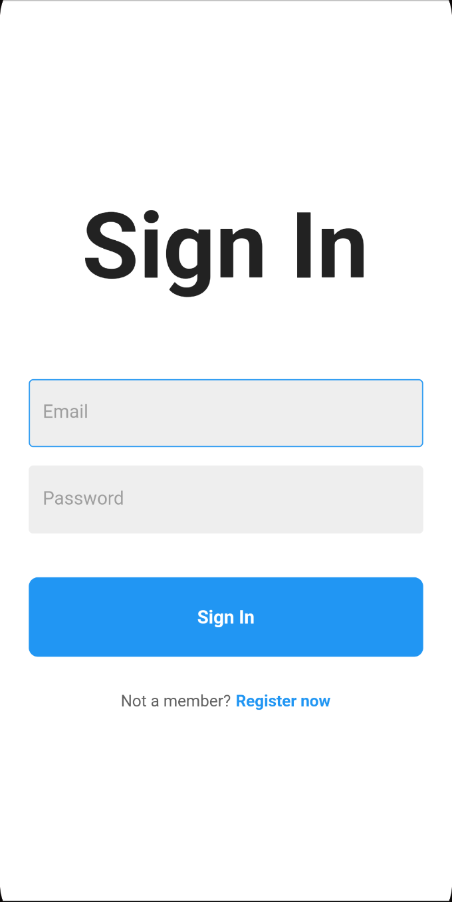
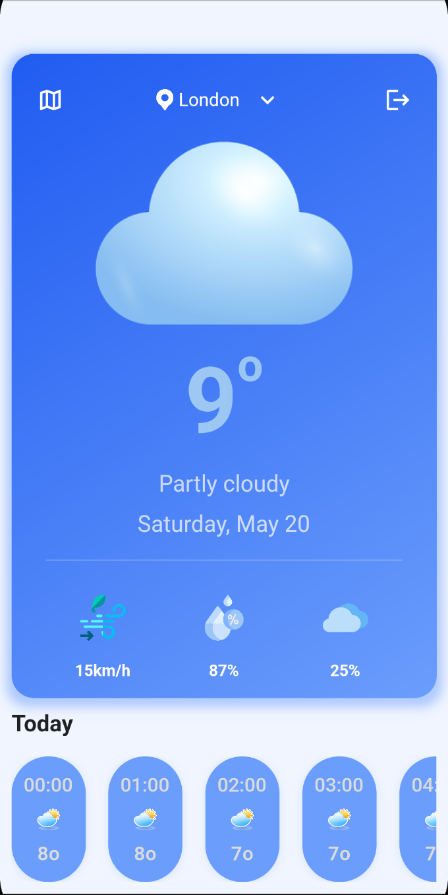
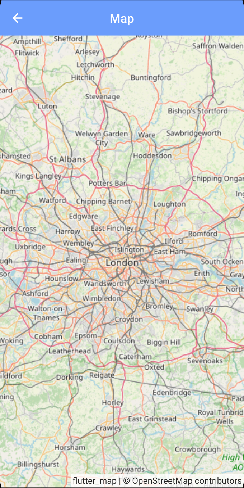
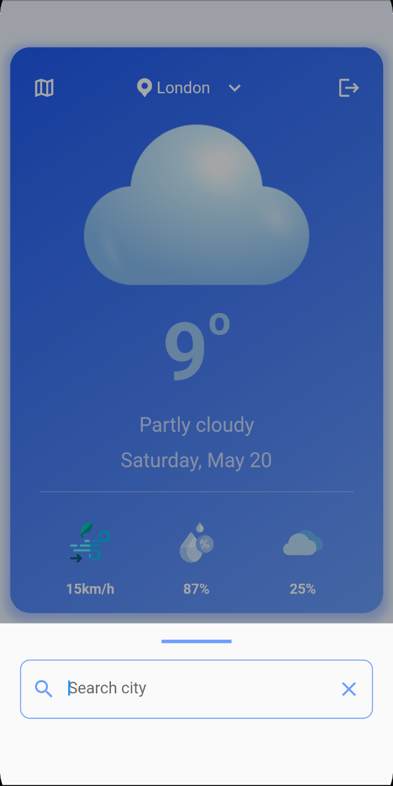
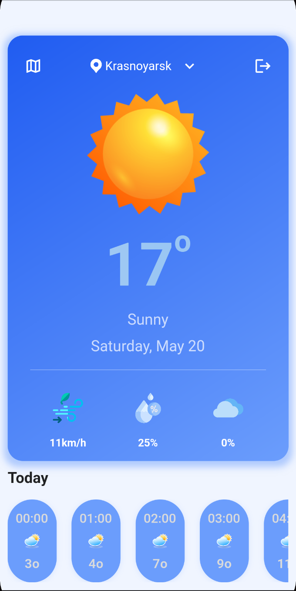

# Weather app

## Руководство пользователя

### Описание
Данное приложение напрвлено на предоставление информации о текущей погоде.

### Страницы приложения
При первом запуске пользователя встречает страница регистрации.  
Далее пользователь может зарегистрироваться, либо войти в уже существующий аккаунт.

 

После входа откроется страница с погодой. Снизу расположен прогноз погоды на сегодня (можно листать).

Иконка карты (слева сверху) открывает карту, чтобы выйти из карты нужно нажать стрелочку (слева сверху).

При нажатии на название города (по центру сверху), откроется строка поиска города, при вводе открывается страница с прогнозом погоды введеного города.

 

Иконка выхода (справа сверху) выполняет выход из аккаунта. После выхода открывается страница входа.
